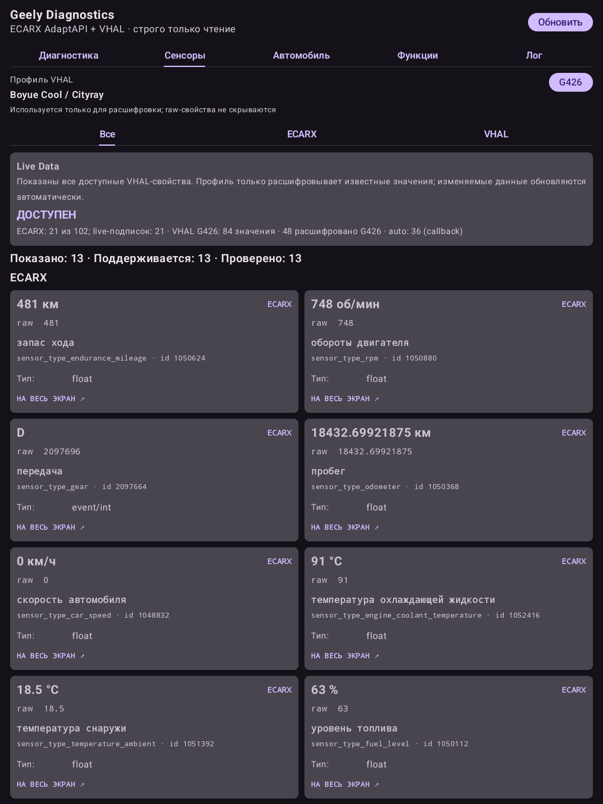
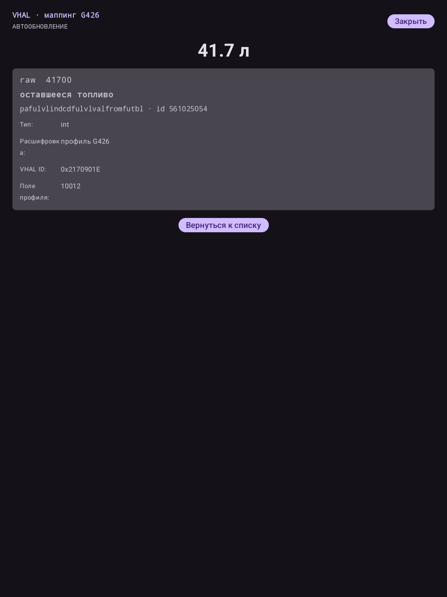

# Geely Diagnostics

[](https://github.com/lisindima/GeelyDiagnostics/actions/workflows/android-ci.yml)

Read-only приложение на Kotlin и Jetpack Compose для автомобилей Geely, чья
штатная головная система предоставляет системный VHAL и/или ECARX AdaptAPI.

> Неофициальный исследовательский проект. Он не связан с Geely или ECARX и не
> заменяет сертифицированную автомобильную диагностику.

## Интерфейс

<table>
  <tr>
    <td></td>
    <td></td>
  </tr>
  <tr>
    <td align="center">Единый каталог ECARX и VHAL</td>
    <td align="center">Полноэкранный режим значения</td>
  </tr>
</table>

## Возможности

Приложение содержит три основных раздела:

- **Диагностика** — три переключаемых раздела: **«Блоки ECU»** с таблицами DTC,
  **«OBD2»** с текущим кадром, стоп-кадрами и подробностями доступа,
  **«Сведения»** с PartInfo и наличием диагностических API. Несколько ошибок
  одного блока показываются отдельными строками; у каждого раздела своя позиция прокрутки;
- **Данные** — единый каталог ECARX AdaptAPI и системного VHAL. Категории
  **«Все»**, **«Параметры»**, **«Автомобиль»** и **«Возможности»** теперь являются
  фильтрами одного экрана, а не отдельными вкладками. Подтверждённые соответствия
  источников объединяются по стабильному `propertyId`, источники остаются видны
  на карточках, а неподтверждённые сигналы показываются отдельно без догадок.
  Общие поиск, фильтры расшифровки/raw/изменений/ошибок и избранное применяются к
  выбранной категории. Значения разделяются на секции автоматического обновления
  по подписке и ручного обновления;
- **Журнал** — журнал ECARX, VHAL и приложения с фильтрами и локальной кнопкой
  очистки. Для VHAL в него
  попадает первоначальное чтение каждого свойства и только реально изменившиеся
  live-значения из callback-подписок; одинаковые raw подряд не дублируются.

Полный снимок можно повторить кнопкой **«Обновить»** в верхней панели. На время
опроса кнопка блокируется, чтобы не запускать источники повторно.
Рядом расположены общие **«Настройки VHAL»**: транспорт применяется к каталогу
данных и OBD2, профиль — к расшифровке каталога. Настройки доступны с любой вкладки.

Кнопка **«Экран / Insets»** открывает диагностику рабочей области дисплея. Она в
реальном времени показывает физический дисплей, размеры окна, density,
`current/maximumWindowMetrics`, visible frame и Insets типов `statusBars`,
`navigationBars`, `systemBars`, `safeDrawing`, `safeContent`, `tappableElement`,
`systemGestures`, `mandatorySystemGestures` и `ime` в px и dp. Рассчитанная safe
area и источник bottom inset отображаются отдельно. IME виден только как
диагностическое значение и не входит в постоянную safe area.

Safe area применяется один раз в корне Activity: весь основной UI, включая
нижние элементы прокручиваемых списков, заканчивается выше зарезервированной
области. В режиме `Auto` выбирается максимальный meaningful system inset; OEM
fallback используется только при нулевом системном значении и не суммируется с
ним. Для G426 встроенная высота пока равна `0 px` до проверки на Cityray. В debug-
окне можно выбрать `System only` или вручную задать `OEM override`, а также
включить цветную визуализацию границы поверх основного интерфейса.

В верхней панели доступен экспорт полного диагностического снимка в JSON через
системный выбор файла Android. В отчёт входят статусы источников, DTC, display и
raw всех значений, выбранный VHAL-профиль и журнал. Экспорт записывает только
пользовательский файл и ничего не изменяет в автомобиле. Если на ГУ отсутствует
системный выбор файла, отчёт сохраняется в общедоступную папку
`Download/GeelyDiagnostics` («Загрузки»). При ошибке MediaStore используется
резервный каталог приложения.

Интерфейс поддерживает светлую и тёмную цветовые схемы и автоматически следует
системной теме Android. Отдельного переключателя внутри приложения нет: при
изменении night mode Compose перестраивает экран с системной схемой.
Шапка, статусные блоки, заголовки секций, ECU и основные значения используют
единый tonal-акцент Material 3 через системные `primaryContainer/onPrimaryContainer`;
таблицы и длинный текст остаются на нейтральных поверхностях для читаемости.

Каталоги строятся по публичным константам той версии AdaptAPI, которая реально
установлена на ГУ. Перед чтением каждого элемента вызывается соответствующий
`is…Supported`. Поэтому наличие константы в API не принимается за доказательство
поддержки конкретным автомобилем.

Карточки всех категорий раздела **«Данные»** используют единый компонент: сначала
показывают источник и тип данных, затем крупное текущее
значение на системной tonal-плашке, выделенное название системным шрифтом и
приглушённый точный raw. В технической строке параметра отображается настоящее имя
поля источника и, для нормализованных значений, явно подписанный внутренний ID.
Полные технические детали доступны в полноэкранном режиме.
У объединённого параметра может быть несколько бейджей и отдельное raw-значение
каждого источника. Бейдж VHAL явно показывает профиль или `RAW`. Неизвестные коды не угадываются и
остаются в исходном виде. Нажатие на карточку параметра, сведений об автомобиле или
функции открывает значение на весь экран; live-значения во всех каталогах
продолжают обновляться напрямую из точечного `Flow`. В полноэкранном режиме
название и API-поле образуют отдельный
заголовок над крупным значением и отделены от него линией, как заголовки таблиц
диагностики. Для числовых измерений экран также показывает график
за последние две минуты текущего сканирования, его минимум и максимум; история
ограничена 360 точками на параметр. Карточки показывают время последнего получения значения; непрерывные
сенсоры помечаются как устаревшие, если ожидаемые обновления прекратились. Значения
можно добавить в избранное кнопкой со звездой, выбор сохраняется локально.

В ECARX-каталог встроены исследованные metadata для всех констант текущих stubs:
русские названия 102 сенсоров, 52 полей CarInfo и 272 функций, единицы измерения
и известные enum-значения. Для скорости применяется подтверждённое преобразование
`raw × 3,6` в км/ч; исходное значение при этом всегда остаётся видимым.

VHAL-маппинг не привязан к одной модели. По умолчанию выбран безопасный профиль
`RAW`: приложение показывает полный каталог без предположительной расшифровки.
Стандартные свойства Android Automotive распознаются независимо от профиля через
`VehiclePropertyIds`: карточки получают AOSP-имя и понятный заголовок, а
подтверждённые соответствия нормализуются. Скорость переводится из м/с в км/ч,
топливо — из миллилитров в литры, запас хода — из метров в километры, значения
передач декодируются по `VehicleGear`; точный raw всегда сохраняется рядом.
Фактическая `PERF_VEHICLE_SPEED` и предназначенная для отображения
`PERF_VEHICLE_SPEED_DISPLAY` остаются разными параметрами и не смешивают события.
В диалоге **«Настройки VHAL»** можно явно выбрать один из доступных профилей:
`FS11_A2`, `KX11_A2`, `KX11_22_LSHD`, `KX11_24`,
`KX11_24_TJ`, `KX11_25`, `FX12`, `FX121_8`, `FS12`, `FX11`, `G636` или `G426`.
Выбор сохраняется локально и используется только как декодер. Каталог при этом
всегда строится из всех свойств, которые сообщает VHAL автомобиля: несовпавшие с
профилем свойства не скрываются, а показываются как raw. Для зональных свойств
отдельно учитывается каждый `areaId`. В приложение встроена только read-часть
маппингов; поля и преобразования записи удалены.

### Нормализация и выбор источника

`car_properties.json` — нормализованный каталог GeelyDiagnostics, основанный на
исследовании AutoService, а не бинарно совместимая копия его контракта.
Для одного свойства ECARX и VHAL возвращают одинаковый тип `CarValue` и одинаковые
единицы. Display форматируется после преобразования; точный raw хранится отдельно.
Тип `FLOAT` используется также для `10011` (топливо, %), `10012` (топливо, л),
`10021` (RPM), `10022` (запас хода), `10055` (педаль тормоза), `10058` (угол руля)
и `10060` (запас хода батареи): деление в профилях и дробные ECARX-измерения
не должны превращать объявленный `INT` в неявный `FloatValue`.
Неизвестные ECARX enum остаются raw с ошибкой преобразования, без подстановки
передачи или другого состояния по умолчанию. Новые соответствия для зажигания,
режима автомобиля и тормозной жидкости в общий каталог не предполагаются.

При совпадении **одного signalId** сначала применяется mapping выбранного профиля;
при его отсутствии — явный нормализующий AOSP mapping. Если оба отсутствуют,
остаётся отдельная AOSP-расшифровка или raw. Профильное значение не перезаписывается
последующим AOSP-декодированием.

Для **разных источников одного нормализованного свойства** при одинаковой доступности
приоритет такой: выбранный профиль VHAL → ECARX → AOSP VHAL → raw.
Более свежий callback менее приоритетного источника не меняет primary.
При ошибке, недоступности или истечении ожидаемого интервала непрерывной подписки
выбирается доступный свежий источник; после восстановления preferred source
приоритет возвращается. Событийные и ручные значения не устаревают из-за отсутствия
изменений. Проверка возраста работает только с кэшем и не опрашивает автомобиль.
Альтернативные readings сохраняются независимо от выбранного primary.

Начальное чтение VHAL сначала обрабатывает свойства с известными нормализующими
mapping, затем остальной каталог; результаты публикуются постепенно. Чтение
ограничено четырьмя worker-потоками и таймаутом 3 секунды на запрос. Подписки первой
группы продолжают работать во время оставшегося сканирования. Таймаут не гарантирует
прерывание зависшего системного Binder-вызова, но не создаёт дополнительные потоки.

Экспорт JSON версии схемы `9` сохраняет типизированные `normalizedValue`, единицы,
`mappingOrigin`, фактический backend каждого VHAL reading, признак `primary` и
`readTransform` в формате pipeline (`steps`; пустой список означает identity).
`normalizedPropertyName` — локализованное название свойства. В `vhalDiscovery`
видны этапы `mappedBootstrapReady`, `rawDiscoveryRunning`, `rawDiscoveryCompleted`.
Профили и транспорт по-прежнему выбираются вручную: превосходство HIDL над
CarPropertyManager на конкретной ГУ требует сравнения экспортов с машины.
Секция `display` содержит метрики окна, все измеренные Insets, calculated safe
area, её source, режим и применённый OEM-профиль.

### ECARX и OBD2 в диагностике

Для ECU 1–8 используются обозначения IHU, CSD, WPC, CCSM, AUD, TEM2, VCM и PAC,
подтверждённые таблицей `IECU` в SDK. Они не означают, что приложение видит все
блоки автомобиля. Неизвестный `ecuType` сохраняется без предположительной расшифровки.
Форматирование времени ECARX DTC осталось прежним: Unix milliseconds.

PartInfo читает семь известных полей идентификации сборок и модулей; ошибка одного
поля не скрывает остальные. В секции возможностей проверяется наличие методов,
а не возможность их успешного вызова. Расширенные `diag*` методы и мониторинг
автоматически не включаются и не вызываются.

OBD2 обрабатывается отдельно от ECARX DTC и обычного каталога параметров:

- HIDL использует только объявленные доступными для чтения `OBD2_LIVE_FRAME`,
  `OBD2_FREEZE_FRAME_INFO` и `OBD2_FREEZE_FRAME`. Маска наличия значений учитывает
  все integer-слоты перед float-слотами; исходные контейнеры сохраняются в JSON.
- В режиме Car API используется опциональный `CarDiagnosticManager` того же
  CarService: OBD2 не читается через обычный `CarPropertyManager`. Для чтения и
  подписки требуется выданное системой `android.car.permission.CAR_DIAGNOSTICS`;
  одной декларации разрешения в manifest недостаточно.
- Live frame обновляется по подписке, если регистрация удалась. Стоп-кадры читаются
  при ручном сканировании по точным int64 timestamps из списка INFO, без конвертации
  в `Double` или календарную дату. За один опрос загружается до 32 стоп-кадров;
  полный полученный список timestamps остаётся в экспорте.
- `OBD2_FREEZE_FRAME_CLEAR` исключён из чтения и подписок. Отсутствие кадров или
  свойств не интерпретируется как отсутствие неисправностей. Наличие API в другой
  прошивке не гарантирует его доступность на конкретной Geely.

JSON содержит дополнительные секции `ecarxDiagnostics` и `obd2`, включая raw,
ошибки, источник, результаты проверки поддержки, ECU-обозначения и API-сигнатуры.
Значения датчиков OBD2 пока показываются без дополнительных пересчётов и не
объединяются с нормализованными параметрами по неподтверждённым соответствиям.

## Структура проекта

- `MainActivity.kt` — Android entry point, Compose host и системный экспорт JSON;
- `model/` — состояние экранов, статусы и общие модели каталогов;
- `export/` — формирование read-only диагностического отчёта;
- `ui/GeelyDiagnosticsApp.kt` — общий app shell, тема, заголовок и навигация;
- `ui/viewmodel/` — сбор `StateFlow` диагностической сессии, избранное и lifecycle
  соединений;
- `ui/tabs/` — независимая реализация вкладок диагностики, параметров,
  единого каталога данных и журнала;
- `ui/components/` — общие карточки, полноэкранное значение и график измерений;
- `ui/display/` — единая display safe-area policy, Compose provider, debug-экран
  Insets и визуальный validation overlay;
- `ui/catalog/` — поиск, фильтры и определение свежести данных;
- `src/debug/.../ui/preview/` — Compose Preview для поддерживаемых экранов ГУ;
- `src/test/` — unit-тесты, разложенные зеркально production-пакетам;
- `vehicle/property/VehicleParameter.kt` — единая модель данных всех трёх каталогов, где
  `CarPropertyId` является основной идентичностью, а ECARX/VHAL представлены
  вложенными исходными показаниями; раздел входит в идентичность и исключает
  коллизии одинаковых ID между сенсорами, сведениями и возможностями;
- `vehicle/mapping/` — read-only профили автомобилей и преобразования raw;
- `vehicle/source/VehicleParameterDataSource.kt` — общий read-only контракт
  источников;
- `vehicle/repository/` — диагностика, единый кэш по
  `section + propertyId + areaId`, наблюдаемый каталог и `Flow` для общего списка
  и `observe(CarPropertyId, areaId, section)`; полноэкранные значения всех
  каталогов получают live-обновления напрямую из этого потока;
- `src/test/.../vehicle/source/MockCarDataSource.kt` — in-memory test double;
  он отсутствует во всех APK и используется только unit-тестами;
- `vehicle/ecarx/` — подключение ECARX, метаданные, декодеры и независимые readers
  диагностики, параметров, заводских сведений и возможностей;
- `vehicle/vhal/` — два read-only транспорта VHAL: системный `CarPropertyManager`
  и прямой HIDL 2.0 для сравнения со старыми системами Geely, а также общий
  реестр стандартных Android Automotive properties.

## Гарантия Read Only

ECARX-клиент приложения использует только:

- `Car.create()` и getters менеджеров;
- `getDtcInfos()` и DTC watcher;
- `isSensorSupported()`, sensor getters и sensor listener;
- `isCarInfoSupported()` и `getCarInfo*()`;
- `isFunctionSupported()`, `getFunctionValue()`,
  `getSupportedFunctionValue()` и `getSupportedFunctionZones()`.

В app-коде отсутствуют `setFunctionValue`, `setCustomizeFunctionValue`,
`setMonitorEnable`, DTC clearing, `IShCommand`, CAN/shell-команды и
низкоуровневые записи vehicle properties. Кнопка **«Очистить»** удаляет
только текст журнала из UI.

По умолчанию VHAL-клиент использует `CarPropertyManager`: системный `CarService`
сам выбирает AIDL или HIDL backend. Для проверки старых ГУ сохранён временный
переключатель на прямой HIDL 2.0. Выбранный транспорт сохраняется локально и
записывается в экспорт как `vhalBackend`, что позволяет сравнить два отчёта.

Оба транспорта читают полный доступный им каталог и регистрируют callback для
автоматического обновления изменяемых свойств. Подписки снимаются при закрытии,
смене профиля или транспорта. Фоновый polling не используется. Реализации не
вызывают `setProperty()`, `set()` и не содержат write-маппингов.

## Compose Preview

Откройте
`app/src/debug/java/com/geelydiagnostics/app/ui/preview/DiagnosticsPreview.kt` и включите
Design или Split. Основные экраны доступны в трёх группах: Cityray/Atlas
`1440×1920`, Monjaro 2023–2025 `1920×720` и рабочий профиль Monjaro 2026+
`2560×1600`. Также есть состояния частичной/ошибочной доступности параметров и
варианты диагностики в светлой и тёмной темах.

## Совместимость

- Android 11+ (`minSdk 30`), проверено на Android 11 / API 30;
- для данных ECARX требуется штатная реализация `com.ecarx.xui.adaptapi.*`;
  без неё приложение продолжает работать с доступным системным VHAL;
- набор доступных сенсоров, сведений и функций зависит от модели, комплектации и
  версии ПО ГУ;
- ECARX показывает подтверждённые API элементы, а VHAL — полный каталог конфигураций;
  ошибка чтения VHAL остаётся видимой на карточке и не скрывает само свойство.

## Сборка

Проект использует `minSdk 30`, `compileSdk/targetSdk 35`, Build Tools 36.0.0 и
Java 17.

```bash
./gradlew :app:assembleDebug
```

Готовый APK публикуется отдельно от исходников в
[GitHub Releases](https://github.com/lisindima/GeelyDiagnostics/releases).
Имя опубликованного файла содержит версию релиза, например
`GeelyDiagnostics-v0.13.0-debug.apk`.

Пакет: `com.geelydiagnostics.app`. Logcat tag: `GeelyDiagnostics`.

Для установки и сбора screenshot/logcat можно использовать:

```bash
./scripts/collect_diagnostics_result.sh
```

Скрипт по умолчанию использует APK из `app/build/outputs/apk/debug/app-debug.apk`
и требует ровно одно подключённое и авторизованное ADB-устройство. Путь к
скачанному APK из Releases можно передать первым аргументом. Результат сохраняется
в `diagnostics-results/<дата-время>/`.

## Благодарности

Спасибо [Salat39](https://github.com/Salat39) за вклад в развитие проекта и
[Mikhail2092](https://github.com/Mikhail2092/geely-third-party-software-analysis)
за исследование Geely VHAL и опубликованные профили маппинга.
